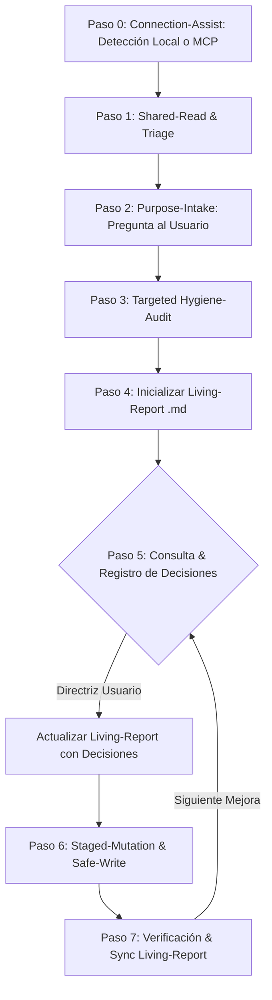

# Excel Assist

Skill **genérica y universal** para auditar, diagnosticar, estandarizar y modificar de forma segura cualquier tipo de libro de cálculo Excel (`.xlsx`), operando de manera nativa sobre carpetas locales o bibliotecas en la nube de **SharePoint**, **OneDrive** y **Google Drive**.

Incluye asistencia completa de conexión: ayuda al usuario a localizar el archivo en su equipo mediante detección de sincronización local o configurando un puente **MCP (Model Context Protocol)** contra las APIs de Microsoft 365 / Graph o Google Workspace.

Es aplicable a cualquier dominio de negocio:
* 🏗️ **Operaciones y Proyectos**: Cartas Gantt, matrices de compromisos, minutas de acuerdo, bitácoras de obra.
* 💰 **Finanzas y Control de Gestión**: Presupuestos, flujos de caja, estados de pago, conciliaciones y costos.
* 📦 **Logística e Inventario**: Catálogos de prendas/artículos, stock en tránsito, balance de masas, activos fijos.
* 👥 **Personas y Dotación**: Nóminas, turnos, matrices de polifuncionalidad, control de asistencia.
* 📊 **Métricas y BI**: Registros de indicadores clave, encuestas, reportabilidad a comités y directorios.

---

## Conceptos Clave (Leading Words)

* **`connection-assist`**: Asistencia guiada para conectar con el archivo donde sea que resida. Si el usuario indica *"está en mi SharePoint / Drive / empresa"*, el agente averigua si está sincronizado en disco local (`local-sync-first`) o lo guía para conectar mediante un servidor **MCP**.
* **`purpose-intake`**: Entrevista breve de alineación inicial. El agente **nunca asume a ciegas las reglas de negocio**: tras la lectura inicial, pregunta al usuario para qué se usa el libro y en qué áreas específicas necesita asistencia o mejoras prioritarias.
* **`shared-read`**: Lectura segura del archivo binario en memoria usando flags de compartición de Windows (`FILE_SHARE_READ | FILE_SHARE_WRITE | FILE_SHARE_DELETE`). Permite inspeccionar el libro en tiempo real sin obligar al usuario a cerrar Excel.
* **`hygiene-audit`**: Escaneo sistemático en 5 vectores de calidad de datos adaptado al tipo de libro:
  1. *Integridad de Claves*: Detección de IDs/códigos duplicados y filas fantasma.
  2. *Uniformidad de Tipos*: Detección de fechas híbridas (texto plano vs `datetime`) y números guardados como texto.
  3. *Deriva Taxonómica*: Errores ortográficos, mayúsculas/minúsculas y variaciones informales en columnas categóricas.
  4. *Trazabilidad de Gestión*: Columnas faltantes indispensables (fechas de cierre real, respaldos/enlaces, responsables únicos).
  5. *Ergonomía y Usabilidad*: Paneles inmovilizados (`Freeze Panes`), dropdowns nativos y semáforos condicionales.
* **`living-report`**: Documento Markdown evolutivo (`docs/diagnostico-y-mejora-<nombre>.md`) que opera como fuente única de verdad. **No es un reporte estático de una sola vez**: se actualiza dinámicamente cada vez que el usuario entrega una directriz y cada vez que se aplica una mutación en disco.
* **`safe-write`**: Modificación atómica y control de bloqueos: si el usuario tiene el archivo abierto, genera una copia de trabajo (`_normalizado.xlsx` o `_temp.xlsx`), solicita el cierre de Excel y ejecuta el reemplazo limpio preservando validaciones nativas (`DataValidation`).

---

## Flujo de Trabajo



---

### Paso 0 — Connection-Assist (Asistencia de Conexión al Archivo)

Cuando el usuario menciona un archivo pero no entrega una ruta directa, o indica que está en una plataforma en la nube (SharePoint, OneDrive, Teams, Google Drive), el agente debe guiar la conexión mediante dos vías:

#### Vía A: Detección de Sincronización Local (`local-sync-first`) — *Más rápida y sin fricción*
1. La mayoría de los usuarios corporativos tienen SharePoint/OneDrive sincronizados en su disco local.
2. El agente inspecciona el perfil de usuario:
   ```powershell
   Get-ChildItem -Path "C:\Users\$env:USERNAME" -Directory | Select-Object Name
   ```
   Buscando carpetas como `OneDrive`, `OneDrive - <Empresa>` o carpetas de tenant de SharePoint (ej. `C:\Users\...\<Nombre_Empresa>\`).
3. Si detecta carpetas sincronizadas, busca el archivo por nombre o extensión:
   ```powershell
   Get-ChildItem -Path "C:\Users\$env:USERNAME\<Empresa>" -Filter "*<nombre_archivo>*.xlsx" -Recurse -Depth 4
   ```
4. Si lo encuentra, informa al usuario la ruta local detectada y salta directamente al **Paso 1** (utilizando `shared-read`).

#### Vía B: Conexión mediante Servidor MCP (`mcp-bridge`) — *Acceso Nube / Sin Sincronización Local*
Si el archivo reside exclusivamente en la nube o el usuario solicita conexión remota:
1. **Verificar o instalar Azure CLI**:
   * Comprobar `az --version` (si falta, instalar vía `winget install --id Microsoft.AzureCLI -e`).
2. **Iniciar sesión en el Tenant de la Empresa**:
   * Instruir al usuario a ejecutar en PowerShell:
     ```powershell
     az login --allow-no-subscriptions
     ```
     *(o especificando el tenant si aplica: `az login --tenant <tenant-id> --allow-no-subscriptions`).*
3. **Configurar el servidor MCP en `mcp_config.json`**:
   * Registrar un servidor en `~/.gemini/config/mcp_config.json` (por ejemplo un script lector como `mcp_graph_reader.js` o paquete MCP de Office 365) asegurando modo de solo lectura si el usuario solo desea consultar.
4. **Validar conexión**:
   * Ejecutar una consulta de prueba (`az account get-access-token --resource-type ms-graph`) para confirmar la obtención del Bearer token y listar los sitios o unidades accesibles.

**Criterio de completitud**: El agente tiene una ruta local accesible o un endpoint/token MCP activo para leer el libro Excel.

---

### Paso 1 — Shared-Read & Triage Rápido

Localiza el archivo objetivo. Si está en SharePoint/OneDrive o local, usa la utilidad compartida para cargarlo en memoria:

```python
from scripts.safe_excel import load_workbook_safe

wb = load_workbook_safe(r"<ruta_al_archivo_excel>", data_only=False)
```

Extrae metadatos preliminares: lista de hojas, cantidad de filas/columnas y encabezados principales.

**Criterio de completitud**: El libro carga en memoria sin generar excepciones de permisos (`Errno 13` / `Error 32`), teniendo identificada la estructura de hojas y sus dimensiones.

---

### Paso 2 — Purpose-Intake (Alineación de Propósito y Expectativas)

Antes de asumir qué arreglar o cómo reestructurar la información, **el agente debe plantear dos preguntas abiertas directamente en el chat en texto plano** (sin modales interactivos restrictivos):

1. **Propósito y Audiencia**:  
   * *"¿Cuál es el objetivo principal de este Excel y quiénes lo utilizan o revisan habitualmente?"* (ej. comité de gerencia, operarios en planta, control financiero, seguimiento contractual).
2. **Foco de Ayuda Deseado**:  
   * *"¿En qué aspectos específicos te gustaría que te ayude o qué problemas/dolores buscas resolver?"*  
     * Ejemplos de focos comunes:
       * 🧹 **Limpieza de datos**: Desorden en columnas, inconsistencias de tipeo, duplicados o filas vacías.
       * 📅 **Corrección de fechas y formatos**: Arreglar filtros que no agrupan por año/mes o números como texto.
       * 🔒 **Estandarización y Dropdowns**: Crear listas desplegables y restringir valores permitidos.
       * 🎨 **Ergonomía visual y Semáforos**: Inmovilizar cabeceras y aplicar colores ejecutivos pasteles para lectura rápida.
       * ⚙️ **Fórmulas y Automatización**: Cálculos de desvíos, plazos o tablas dinámicas.
       * 🚀 **Revisión Integral / 360°**: El agente audita todos los aspectos y propone un roadmap completo.

**Criterio de completitud**: El usuario responde indicando el contexto de uso y las prioridades de mejora (o solicita una auditoría integral abierta).

---

### Paso 3 — Targeted Hygiene-Audit (Auditoría Orientada)

Inspecciona la hoja objetivo evaluando los 5 vectores, poniendo especial énfasis en las prioridades declaradas en el Paso 2:

1. **Claves Primarias (IDs)**:
   * Contar IDs no nulos vs valores únicos (`collections.Counter`).
   * Listar todos los IDs duplicados con su número de fila y título.
   * Identificar filas fantasma (filas con solo el ID o celdas en blanco).
2. **Tipos de Datos (Fechas y Números)**:
   * Inspeccionar columnas de fecha (ej. `Plazo original`, `Fecha compromiso`).
   * Cuantificar cuántas celdas son objetos nativos `datetime` vs cadenas de texto (`str`).
3. **Columnas Categóricas y Taxonomía**:
   * Para columnas como `Estado`, `Prioridad`, `Equipo`, `Bloqueante`: listar todos los valores únicos y frecuencias.
   * Detectar variantes de tipeo (ej. `"En Curso"` vs `"En curso"`, `"Sí"` vs `"Si"`).
4. **Completitud y Control de Gestión**:
   * Detectar columnas con más del 50% de valores vacíos (abandonadas).
   * Verificar existencia de campos indispensables de auditoría (fechas de cierre real, evidencia verificable, owner único).
5. **Ergonomía en Excel**:
   * Verificar si `ws.freeze_panes` está configurado.
   * Verificar reglas de formato condicional y validación de datos existentes.

**Criterio de completitud**: Cada uno de los 5 vectores cuenta con métricas exactas (conteos, filas y ejemplos) documentados en memoria.

---

### Paso 4 — Inicializar Living-Report Dinámico (`.md`)

Crea el archivo Markdown persistente en `docs/` (o en la carpeta documental del proyecto) estructurado con:

1. **Metadatos y Contexto Declarado**: Archivo fuente, método de conexión (local/SharePoint/OneDrive/MCP), fecha y el **propósito y foco definidos por el usuario en el Paso 2**.
2. **Tablero Dinámico de Mejoras (Roadmap)**:
   * Tabla con cada vector evaluado y su estado dinámico:
     * ✅ **`Resuelto`**: Implementado y verificado en disco.
     * 🟡 **`En Curso / Acordado`**: Definido con el usuario, pendiente de ejecución.
     * ⚪ **`Pendiente`**: Identificado en el diagnóstico, a la espera de definición.
3. **Detalle Técnico de Hallazgos**: Desglose con números de fila, valores anómalos y causas raíz.
4. **Estructura Vigente de Columnas**: Diccionario de datos de la hoja auditada.
5. **Historial de Cambios (Changelog)**: Registro cronológico de cada mutación aplicada.

**Criterio de completitud**: El archivo `.md` existe en disco con enlaces clicables, el canal de conexión y propósito documentados, y el roadmap en estado inicial.

---

### Paso 5 — Consulta con el Usuario y Registro Dinámico de Decisiones

Antes de modificar celdas que impliquen decisiones de negocio:
* **Plantear las alternativas directamente como texto plano en el chat** (sin modales restrictivos).
* Indicar casos ambiguos (ej. valores sin mapeo claro, equipos compartidos, filas con dudas) y proponer una asignación por defecto (`A definir`).
* Para semáforos o colores, **presentar la paleta antes de aplicarla** consultando la guía de referencia [PALETTES.md](PALETTES.md).
* **Sincronización Inmediata del Living-Report**: Apenas el usuario entregue una directriz (ej. *"los casos de 'Ambos' asúmelos como LGC + MAINDSET"* o *"crea la columna Fecha cierre"*), **actualizar inmediatamente el `.md`** en la sección de acuerdos para que el historial quede blindado contra pérdida de contexto.

**Criterio de completitud**: El usuario aprueba explícitamente las reglas de mapeo o la paleta visual, y la directriz queda registrada en el `.md`.

---

### Paso 6 — Staged-Mutation & Safe-Write

Aplica los cambios de forma incremental y aislada:

#### 1. Conversión de Fechas
Convierte cadenas de texto a `datetime.datetime` nativo aplicando máscara unificada:
```python
cell.value = datetime.datetime.strptime(val, "%d-%m-%Y")
cell.number_format = "dd-mm-yyyy"
```

#### 2. Estandarización Categórica y Dropdowns
* Actualiza o crea la lista canónica en la hoja auxiliar (ej. `Aux!$C$2:$C$9`).
* Aplica el diccionario de mapeo aprobado sobre la columna objetivo.
* **Preservar / Crear Dropdown Nativo**:
```python
dv = DataValidation(type="list", formula1="=Aux!$C$2:$C$9", allow_blank=True)
ws.add_data_validation(dv)
dv.add(f"F2:F{ws.max_row}")
```

#### 3. Semáforos y Formato Condicional
Aplica estilos directos a las celdas existentes Y agrega reglas de `CellIsRule` dinámicas para garantizar que futuros ingresos mantengan el color (consultar [PALETTES.md](PALETTES.md)).

#### 4. Safe-Write y Control de Bloqueos
```python
from scripts.safe_excel import save_workbook_safe

ok, saved_path = save_workbook_safe(wb, target_path)
if not ok:
    # Informar al usuario que cierre Excel para reemplazar el original
```

**Criterio de completitud**: El archivo queda guardado en disco sin errores de sintaxis XML y conservando todas las validaciones de datos.

---

### Paso 7 — Verificación Post-Mutación y Sincronización del Living-Report

Vuelve a leer el archivo modificado de forma independiente:
1. **Re-auditoría**: Verificar conteo de tipos de datos, valores únicos y filas testigo.
2. **Actualización Obligatoria del Living-Report (`.md`)**:
   * Cambiar el estado del ítem en la tabla del Roadmap a ✅ **`Resuelto`**.
   * Actualizar las métricas cuantitativas (ej. *"188 fechas nativas ahora activas"*).
   * Agregar un registro al **Historial de Cambios (Changelog)** con la fecha/hora y el número de celdas modificadas.
3. **Reporte al Usuario**: Informar el resumen exacto de filas modificadas, la distribución final y confirmar que el archivo puede ser reabierto en Excel.

**Criterio de completitud**: El archivo Excel en disco y el `living-report` `.md` están **100% sincronizados en sus métricas y estados**.
