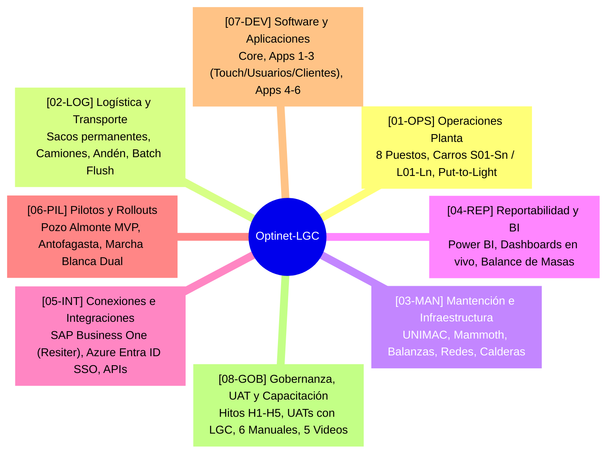
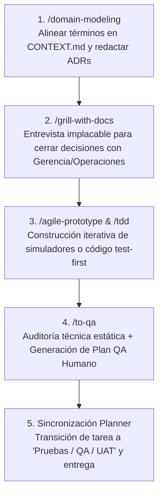

# 🧭 Marco de Trabajo Ágil: Gestión del Proyecto Integral Optinet-LGC con Agentes IA y Microsoft Planner

> **Propósito**: Esta guía define el protocolo maestro de colaboración, gobierno ágil y trazabilidad operativa entre el **Equipo Humano de Le Grand Chic (LGC) / MAindset** y los **Agentes IA de Trabajo**. Establece cómo se gestiona y sincroniza el tablero Kanban en **Microsoft Planner** (`Optinet-lgc Kanban de trabajo`) cubriendo todas las dimensiones del proyecto integral: **Operaciones de Planta**, **Logística y Flota**, **Infraestructura y Mantención**, **Desarrollo de Software / Apps**, **Integraciones (SAP / Entra ID)**, **Pilotos Operacionales (Pozo Almonte / Antofagasta)** y **Gobernanza / UAT**.

---

## 📌 1. Visión y Dimensiones del Proyecto Integral Optinet-LGC

El proyecto **Optinet-LGC** (42 semanas + 6 meses de garantía/Hypercare) no se limita a software: abarca la transformación física, operacional y digital de las plantas de lavandería industrial de LGC, sirviendo contratos mineros de alta exigencia (BHP, Collahuasi, Teck QB2, SQM, etc.).

El tablero global de Planner organiza el trabajo a través de **8 Dimensiones Clave** con identificadores correlativos estandarizados:



### Tabla de Prefijos Maestros de Trazabilidad:

| Prefijo | Dimensión del Proyecto | Alcance y Responsabilidades |
|---|---|---|
| `[01-OPS]` | **Operaciones de Planta** | Definición de flujos, los 8 roles de planta (`PEO`, `ALI`, `REC`, `SEG`, `LAV`, `CAL`, `COS`, `DES`), circuitos de carros sucios `S01-Sn`, limpios `L01-Ln`, pesaje, desmanche con Químico *Orange*, mesa de calidad y Put-to-Light. |
| `[02-LOG]` | **Logística y Transporte** | Manifiesto de camiones en andén, identificación y ruteo de sacos permanentes, custodia de objetos personales ensobrados, tracking GPS y política de *Batch Flush* (barrido de lote por faena). |
| `[03-MAN]` | **Mantención e Infraestructura** | Suministro y calibración de lavadoras/secadoras UNIMAC, termofijadoras Mammoth, balanzas industriales, tablets de grado industrial, hardware de estanterías Put-to-Light, red Wi-Fi industrial y tableros eléctricos. |
| `[04-REP]` | **Reportabilidad y BI** | Dashboards ejecutivos, réplica analítica para Power BI, reportería operacional de productividad por operario/hora, cálculo de mermas, tiempos de ciclo y cumplimiento de contratos mineros. |
| `[05-INT]` | **Conexiones e Integraciones** | Arquitectura y consumo de APIs con SAP Business One (coordinación Resiter TI), autenticación SSO mediante Microsoft Entra ID, integración serial/IP con básculas y modo offline con sincronización *last-write-wins*. |
| `[06-PIL]` | **Pilotos y Rollout** | Planificación, ejecución y ajuste del Piloto Operativo Temprano Pozo Almonte (MVP), Piloto Antofagasta, marcha blanca dual (2 semanas), comités de corte y Go-Live definitivo. |
| `[07-DEV]` | **Software y Apps** | Desarrollo de Sistema Core, APIs REST OpenAPI 3.0, Apps Touch de estación (10 módulos), App Móvil Trabajadores Mineros, Portal Clientes, App Funcionarios LGC y Backoffice web. |
| `[08-GOB]` | **Gobernanza y UAT** | Gestión de Hitos contractuales (H1 a H5), actas de reunión, gestión de cambios (Change Requests), 6 manuales por rol, 5 videos tutoriales, 24h de capacitación presencial/híbrida y sesiones UAT con LGC. |

---

## 🗂️ 2. Estructura de Columnas (Buckets) en Microsoft Planner

El tablero `Optinet-lgc Kanban de trabajo` en Microsoft Planner opera bajo **5 Buckets de Flujo**:


### 1. `💡 Ideas`
* **Definición**: Requerimientos preliminares, mejoras observadas en visitas a terreno, deudas operativas o sugerencias levantadas por operarios o gerencia sin refinar.
* **Responsable**: Cualquier miembro del equipo (LGC, MAindset o Agente IA).

### 2. `📥 Pendiente` *(Ready for Execution)*
* **Definición**: Tareas refinadas con alcance claro, especificación técnica / operativa aprobada (`specs/spec_*.md` o ADR asociado en `docs/adr/`), criterios de aceptación observables y dependencias resueltas.
* **Criterio de Entrada**: Contar con prefijo maestro (ej: `[01-OPS-102]`), responsable asignado y definición de *Done*.

### 3. `⚙️ En ejecución` *(In Progress)*
* **Definición**: Tarea en desarrollo o implementación activa (sea de código, hardware, simulación SVG o manuales).
* **Acción del Agente**: Al iniciar una tarea, actualiza su progreso en Planner a `percentComplete: 50` y registra notas de avance.

### 4. `🧪 Pruebas / QA / UAT` *(Paso Clave de Validación)*
* **Definición**: Implementación finalizada por el agente o el equipo técnico.
  * Si es **Software**: Suite de tests en verde (`100% PASS`), análisis estático limpio, reporte `qa_agent_report.md` y plan de pruebas `qa_human_plan.md`.
  * Si es **Operaciones / Layout**: Plano SVG interactivo validado (ej. `plano-piloto-optinet-mkii.html`), rutas y waypoints calibrados, y sincronización de carros verificada.
  * Si es **Hardware / Integración**: Protocolo de comunicación validado en banco de pruebas o ambiente QA.
* **Acción del Agente**: Mueve la tarea a este bucket y **se detiene** solicitando la validación del usuario humano.

### 5. `✅ Completadas` *(Done / Deployed)*
* **Definición**: Tarea verificada, aceptada formalmente por el Líder de Proyecto / Product Owner de LGC y desplegada en planta o producción.
* **Regla de Oro Inquebrantable**: **EL AGENTE IA TIENE ESTRICTAMENTE PROHIBIDO MOVER TAREAS A COMPLETADAS**. Este paso es prerrogativa exclusiva del Humano.

---

## 📥 3. Mecanismo de Inboxes Rápidos por Área de Planta

Para capturar observaciones directas desde la planta de Pozo Almonte o Antofagasta sin fricción, se mantienen tarjetas fijas **Inbox** en el bucket `💡 Ideas` o `📥 Pendiente`:

* `📥 [INBOX] 01 - Operaciones Planta (Puestos, Carros, Calidad)`
* `📥 [INBOX] 02 - Logística y Andén (Camiones, Sacos, Peoneta)`
* `📥 [INBOX] 03 - Mantención e Infraestructura (Máquinas, Balanzas, Red)`
* `📥 [INBOX] 05 - Integraciones y Datos (SAP BO, Entra ID, Catálogo)`

### Protocolo de Refinamiento de Inboxes:
1. **Captura Rápida Humana**: El equipo de terreno anota comentarios o listas de chequeo en la tarjeta Inbox (ej: *"El carro S02 de ropa pesada necesita 10 cm más de ancho"* o *"Error de lectura de báscula en lote Collahuasi"*).
2. **Solicitud de Refinamiento**: El usuario instruye: *"Revisa el Inbox 01 de Operaciones y genera los tickets accionables"*.
3. **Conversión Estructurada**: El agente:
   - Extrae cada ítem, le asigna su código correlativo formal (ej. `[01-OPS-015] Ajustar gálibo Carro S02`).
   - Redacta la descripción con criterios de aceptación.
   - Crea la tarjeta formal en Planner en `📥 Pendiente`.
   - Limpia el checklist del Inbox.

---

## 🛠️ 4. Protocolo de Sincronización con Microsoft Planner (Azure CLI / MCP)

El agente interactúa con Microsoft Planner a través del script cliente [planner_client.js](file:///c:/dev/AgentGarden/scripts/planner_client.js) o el servidor MCP utilizando el token de **Microsoft Graph** generado por **Azure CLI**:

```bash
# Consultar el estado global del tablero
node c:/dev/AgentGarden/scripts/planner_client.js list

# Crear nueva tarea vinculada a un área
node c:/dev/AgentGarden/scripts/planner_client.js create "[01-OPS-022] Calibrar tiempo de doblado en mesón CAL" "Pendiente"

# Consultar detalles y checklist de una tarea
node c:/dev/AgentGarden/scripts/planner_client.js details <taskId>
```

### Tabla de Operaciones Estándar del Agente:

| Momento | Acción en Planner | Contenido y Metadatos |
|---|---|---|
| **Al iniciar un requerimiento** | `updateTask(taskId, { percentComplete: 50, bucketId: 'En ejecucion' })` | Registra el inicio formal y referencia el ADR / Spec asociado. |
| **Durante el desarrollo** | `updateTaskDetails(taskId, { ... })` | Documenta notas de avance, enlaces a commits o documentación en `docs/`. |
| **Al concluir la implementación** | `updateTask(taskId, { percentComplete: 100, bucketId: 'Pruebas / QA / UAT' })` | Adjunta el resumen de pruebas técnicas (`qa_agent_report.md`) y el plan de validación humana (`qa_human_plan.md`). |
| **Bajo demanda del usuario** | `listBoard()` | Muestra el tablero completo cuando el usuario indique expresamente *"revisa el Planner"*. |

---

## 📑 5. Artefactos Obligatorios por Ciclo de Trabajo en Optinet

Todo entregable en el marco de Optinet debe dejar evidencia auditable en el repositorio:

1. **Decisión de Arquitectura y Negocio (`docs/adr/00XX-nombre.md`)**:
   - Para cambios en procesos de planta, asignación de roles, hardware o reglas de negocio (ej. [ADR 0022 a 0025](file:///c:/dev/optinet-lgc/docs/adr/)).
2. **Actualización del Modelo de Dominio (`CONTEXT.md`)**:
   - Glosario unificado de términos de planta, circuitos de carros y estados de prenda (evitando ambigüedades como "bulto" o "cargador").
3. **Plano y Simulador Digital (`areas/01-operaciones/plano-piloto-optinet-mkii.html`)**:
   - Entregable interactivo de alta fidelidad para gerencia y supervisores de planta.
4. **Especificación Técnica (`specs/spec_[nombre].md`)**:
   - Requerimientos funcionales, contratos de API o diagramas de integración.
5. **Reporte QA Agente (`qa_agent_report.md`)**:
   - Análisis estático, validación de esquemas JSON, compilación y pruebas unitarias.
6. **Plan QA Humano (`qa_human_plan.md`)**:
   - Guía de pruebas paso a paso (Rol, Pasos, Resultado Esperado) para validación en terreno o pantalla en menos de 5 minutos.

---

## 🧭 6. Skills y Flujos Recomendados para Agentes en Optinet

Cuando un agente trabaje en iniciativas del proyecto Optinet, ejecutará las siguientes skills en secuencia:



1. **`/domain-modeling`**: Para mantener el glosario de términos ([CONTEXT.md](file:///c:/dev/optinet-lgc/CONTEXT.md)) y las decisiones de arquitectura ([docs/adr/](file:///c:/dev/optinet-lgc/docs/adr/)) siempre sincronizados con la realidad de planta.
2. **`/grill-with-docs`**: Para desafiar alternativas de diseño con el usuario antes de implementar, actualizando simultáneamente la documentación.
3. **`/agile-prototype`**: Para iterar prototipos y herramientas visuales (MK I $\rightarrow$ MK II $\rightarrow$ MK III).
4. **`/tdd`**: Para desarrollar lógica de software, motores de cálculo o integraciones bajo el ciclo *Red $\rightarrow$ Green $\rightarrow$ Refactor*.
5. **`/to-qa`**: Para auditar la entrega, generar los planes de prueba y notificar al usuario para su aceptación final.
